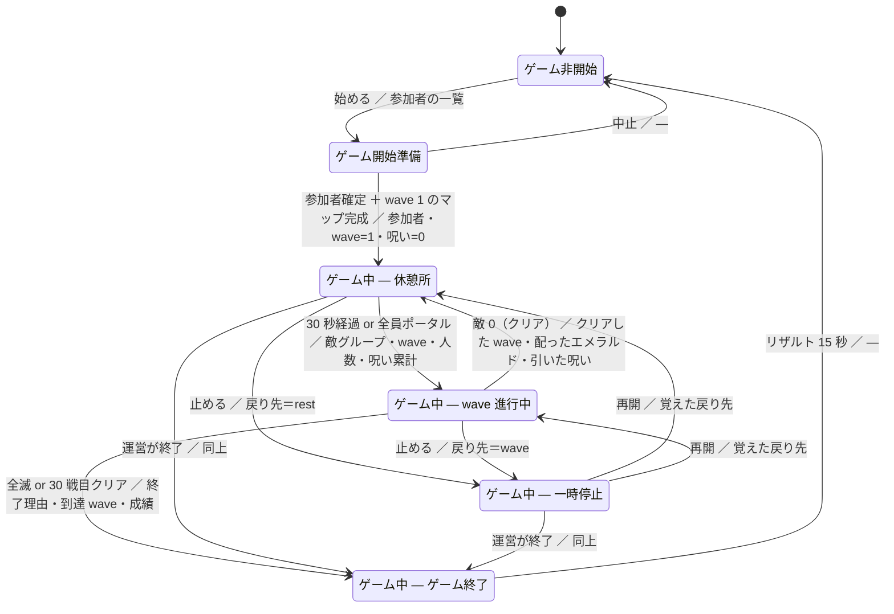
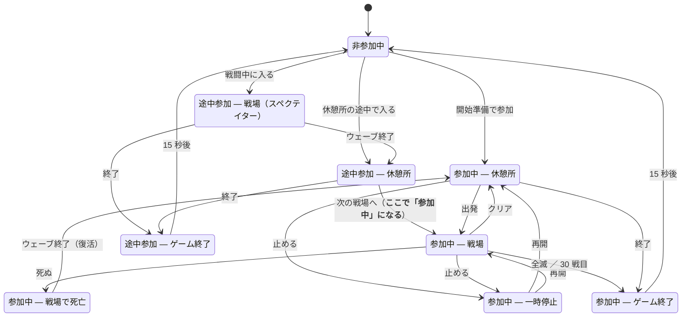

# 仕様: 状態

**2026-09-04 決定。** 進行の流れは [13-flow.md](13-flow.md)、企画は [../00-concept.md](../00-concept.md)。

> ### 何を作るときも、**まず「どの状態で動くか」を決める**
>
> **「いつ動くか」を書かずに機能を足すと、必ず変な所で動く。**
> ロビーで敵が湧く、リザルト中に買える、死んでいる人が撃てる——
> **全部「状態を見ていない」ことが原因になる。**
>
> **機能を足すときは、この文書の表に 1 行足してから書く。**

## 1. 状態は「唯一の正」。**毎周期、そこへ寄せる**

```
状態（動的プロパティ）
   ↓ 毎周期
ゲームモード・居場所・見えるもの・効かせるもの
```

**「切り替えた瞬間に 1 度だけ処理する」形にしない。**
**`/reload`・入り直し・切断復帰で必ず取りこぼす**（`docs/imp.md` 10-7）。

| | |
| --- | --- |
| **持ち方** | **ワールドの状態はワールドに、人の状態はその人に**（動的プロパティ） |
| **変える場所** | **1 か所だけ。** 機能から直接書き換えない |
| **寄せる場所** | **毎周期**。あるべき姿と違えば直す |

## 2. ワールドの状態（6 つ）

### 2-0. 図

**辺のラベルは「条件 ／ 渡すもの」。**



**表に無い遷移は通さない**（`scripts/core/state.ts` の `WORLD_NEXT`）。

### 2-1. 遷移の一覧

| から | へ | 条件 | **渡すもの** | **遷移でやること** |
| --- | --- | --- | --- | --- |
| idle | prepare | **始める操作** | 参加者の一覧 | 参加者を「参加中」にする |
| prepare | rest | **参加者が確定 ＋ wave 1 のマップが完成** | 参加者・wave＝1・呪い＝0 | 全員を休憩所へ |
| prepare | idle | **中止** | — | 参加者を「非参加中」へ戻す |
| rest | wave | **30 秒経過 or 全員ポータル**（＋**マップ完成**） | **敵グループ・wave・人数・呪い累計** | 投票を締める／**途中参加を「参加中」に昇格**／全員を戦場へ／敵を湧かせる |
| wave | rest | **敵が 0** | **クリアした wave・配ったエメラルド・引いた呪い** | 残りを片付ける／報酬を配る／**呪いを n 個引く**／死者を復活 |
| rest / wave | paused | **止める操作** | **戻り先（rest か wave）** | 全員をその場に固定 |
| paused | rest / wave | **再開操作** | 覚えた戻り先 | 固定を解く |
| wave | result | **全員死亡** or **30 戦目クリア** | **終了理由・到達 wave・成績** | 敵を全部片付ける |
| rest / paused | result | **運営が終了** | 同上 | 同上 |
| result | idle | **15 秒経過** | — | **全部リセット**（参加・強化・エメラルド・呪い・wave） |

> ### 「何を渡すか」を決めておく理由
>
> **渡すものが決まっていないと、遷移先が前の状態を覗きに行く。**
> **覗きに行った瞬間、状態は 1 本道でなくなる**——直せなくなる。

### 2-2. 状態ごとの、入口・最中・出口

#### ゲーム非開始（idle）

| | |
| --- | --- |
| **入口でやること** | **全部リセット**——参加を解く／強化とエメラルドを消す／呪いと wave を消す／**戦場の敵を片付ける**／全員をロビーへ |
| **最中** | ロビーを自由に歩ける。**敵は湧かない。マップも作らない** |
| **出口でやること** | 無し |
| **演出** | 無し。**始め方だけが見えていればよい** |

**ここが待機の既定。** ゲームが終われば必ずここへ戻る。

#### ゲーム開始準備（prepare）

| | |
| --- | --- |
| **入口でやること** | **参加者を確定**（その場に居る人を「参加中」へ）／**wave ＝ 1**／**呪い ＝ 0**／**wave 1 のマップを組み始める** |
| **最中** | 開始までの秒読み（仮）。**マップの組み立てを進める** |
| **出口でやること** | **マップの完成を確かめる**——できていなければ待つ |
| **演出** | 秒読み |

> ### 最初の 1 枚は、ここで作る
>
> **休憩所へ入る前に戦場が要る。**
> **wave 1 のマップだけは、この状態で組む**（[14-map-build.md](14-map-build.md)）。

#### ゲーム中 — 休憩所（rest）

| | |
| --- | --- |
| **入口でやること** | 全員を休憩所（−2000, 0, −2000）へ／**必ず ＋z を向かせる**（奥にポータル）／**死んでいた人を復活**（HP 満タン）／**30 秒の砂時計を開始**／**3 択を配る**（相手・モーション強化）／**引いた呪いを見せる**／**次の戦場を組み始める** |
| **最中** | 買う・拾う・投票する。**残り時間を出し続ける** |
| **出口でやること** | **投票を締めて敵グループを決める**／**マップの完成を確かめる**／**途中参加を「参加中」へ昇格** |
| **抜ける条件** | **30 秒経過**、または**全員がポータルに入った** |
| **演出** | 残り時間／引かれた呪い／3 択 |

**組み上がる前に飛ばすと空中に落ちる**——**完成していなければ出発を遅らせる。**

#### ゲーム中 — wave 進行中（wave）

| | |
| --- | --- |
| **入口でやること** | 全員を戦場（0, 0, 0）へ／**HP を満タンに**／**敵グループを湧かせる**（数・HP は人数と呪いで決まる。[16-enemy.md](16-enemy.md)） |
| **最中** | 戦う。**残りの敵数を出す**。**死んだ人はスペクテイターへ** |
| **出口でやること** | **残った敵を片付ける**／**エメラルドを配る**／**呪いを n 個引いて積む** |
| **抜ける条件** | **敵 0 → 休憩所**（ただし **30 戦目ならゲーム終了**）／**全員死亡 → ゲーム終了** |
| **演出** | 残り敵数／wave 番号／HP |

#### ゲーム中 — 一時停止（paused）

| | |
| --- | --- |
| **入口でやること** | **戻り先を覚える**（rest か wave）／**全員をその場に固定** |
| **最中** | **何も進まない**——30 秒の残り・敵の行動・マップの組み立て、全部止める |
| **出口でやること** | **固定を解く**／覚えた戻り先へ返す |
| **抜ける条件** | **再開**（戻り先へ）／**終了**（ゲーム終了へ） |
| **演出** | **止まっていることを出し続ける** |

> ### 「戻る先」を覚えておく
>
> **休憩所で止めたのか、戦場で止めたのかで戻り先が違う。**
> **止めた時点の状態を持っておく**——持たないと戻れない。

#### ゲーム中 — ゲーム終了（result）

| | |
| --- | --- |
| **入口でやること** | **敵を全部片付ける**／**全員を固定**／**成績を集計**（到達 wave ほか） |
| **最中** | **15 秒かけてリザルトを出す** |
| **出口でやること** | **必ず「ゲーム非開始」へ**——リセットは idle の入口が行う |
| **抜ける条件** | **15 秒経過** |
| **演出** | **リザルト（15 秒）** |

> ### 終わりは「即座にロビー」ではない
>
> **勝っても負けても、必ずこの 15 秒を通る。**
> **結果を見せずにロビーへ放り出すと、何が起きたか分からない。**

**リザルトの中身は未定**（到達 wave・総ダメージ・MVP など）。

> ### 飛ばすときは、**必ずブロックの中心へ寄せる**（2026-09-05）
>
> ブロック `(x, z)` が占めるのは **`x` から `x+1`** まで。
> **整数のまま飛ばすと角に立ち、半マスずれる。**
>
> **`core/places.ts` の `center()` を通す。** `Math.floor` を挟んでいるので、
> **すでに中心の値を渡してもずれない**——どの飛ばし方から呼んでも安全。
> **y は触らない**（足元の高さは呼ぶ側が決める）。

### 3-0. **強化を選んでいる**（`picking`）（2026-09-05 追加）

> ### **選び終わったか**を状態で持つ
>
> 以前は機能の中に覚え書きを置いていたので、
> **捨てる場所を 1 つ間違えただけで進行が狂った。**
> **状態にして、毎周期あるべき姿へ寄せる。**

| | |
| --- | --- |
| **いつ** | **幕間に入った瞬間から、選ぶ（か締め切りが来る）まで。****幕間を出たあとも続く**——選んでいる人を待たずに次へ進むため（`13-flow.md` 2 章） |
| **見た目** | **ふつう。** **明るくしてから 3 択を出す**（2026-09-05 変更。暗転は運ぶ間だけ） |
| **動き** | **ふつうに動ける**（2026-09-05 変更）。**UI を開けばそれ自体が動きを止める** |
| **抜ける** | **選んだ**／**時間切れで勝手に引かれた** |
| **持ち方** | その人の動的プロパティ `pve3:picked`（`state/pick.ts`） |

**幕間に入った瞬間に全員を「まだ選んでいない」に戻す。**

### 2-8. **幕間**（`interlude`）（2026-09-05 追加）

> ### 戦場が終わってから、次の場所に立つまで
>
> **暗転している間に、裏で全部やる。**

| | |
| --- | --- |
| **入れる所** | **`wave` からだけ** |
| **出る先** | **`wave`（次も戦場）／ `rest`（3 戦終えた）／ `result`（30 戦目・全滅）** |
| **入口でやること** | **画面を暗くする**／**次の場所へ飛ばす**／**マップを差し替える**／**モーション強化の 3 択を出す** |
| **最中** | **選び終わるのを待つ。** 選ばない人が居ても、上限の秒数で進む |
| **出口でやること** | **画面を明るくする** |
| **演出** | 暗転・明転 |

**次が戦場か休憩所かは、終えた `wave` が 3 の倍数かどうかで決まる**（`13-flow.md` 1 章）。

### 2-9. **建築**（`build`）（2026-09-05 追加）

> ### 戦場を、実際に戦う場所で手直しするための状態
>
> **生成器で下地を組み、ゲーム内で直し、その結果をデータとして焼き付ける。**
> **戦うのと同じ座標（xz ＝ 0, 0）で直す**——別の場所で作ると、
> **置き直したときにずれる。**

| | |
| --- | --- |
| **入れる所** | **`idle`（ゲーム非開始）からだけ。** 試合中には入れない |
| **出る先** | **`idle` だけ** |
| **入口でやること** | 無し。**マップは組み直さない**（手直しを消さないため） |
| **最中** | **敵は湧かない。ウェーブは進まない。** 参加者は居ない（全員 `out`） |
| **出口でやること** | 無し |
| **演出** | 無し |

**人の状態は `out`**——建築中に「参加中」の人は居ない。

## 3. プレイヤーの状態（9 つ）

**「参加中」と「途中参加」を分ける**——**途中参加は戦場に立てない。**

| # | 状態 | ゲームモード | 動けるか | 撃てるか | 買えるか |
| --- | --- | --- | --- | --- | --- |
| 1 | **非参加中** | アドベンチャー | ロビー内は自由 | **不可** | **不可** |
| 2 | **参加中 — 休憩所** | アドベンチャー | 休憩所内 | **不可** | **可** |
| 3 | **参加中 — 戦場** | アドベンチャー | 戦場内 | **可** | 不可 |
| 4 | **参加中 — 戦場で死亡** | **スペクテイター** | 見るだけ | **不可** | 不可 |
| 5 | **参加中 — 一時停止** | そのまま | **止まる** | **不可** | **不可** |
| 6 | **参加中 — ゲーム終了** | そのまま | **止まる** | **不可** | 不可 |
| 7 | **途中参加 — 休憩所** | アドベンチャー | 休憩所内 | **不可** | **可** |
| 8 | **途中参加 — 戦場** | **スペクテイター（必須）** | 見るだけ | **不可** | 不可 |
| 9 | **途中参加 — ゲーム終了** | そのまま | **止まる** | **不可** | 不可 |

### 3-0. 遷移



### 3-0-1. 入口・最中・出口

| 状態 | **入るときにやること** | 最中 | **出るときにやること** |
| --- | --- | --- | --- |
| **非参加中** | ロビーへ／アドベンチャー／**装備を外す** | ロビーを歩く | — |
| **参加中 — 休憩所** | 休憩所へ／**HP 満タン**／3 択を配る | 買う・拾う・投票 | **拾わなかった 3 択を片付ける** |
| **参加中 — 戦場** | 戦場へ／**武器を持たせる** | 戦う | — |
| **参加中 — 戦場で死亡** | **スペクテイターへ**／倒れた演出 | 見る | **HP を満タンに戻す**（復活） |
| **参加中 — 一時停止** | **その場に固定**（居場所を覚える） | 止まる | **固定を解く** |
| **参加中 — ゲーム終了** | **固定**／リザルトを出し始める | 15 秒見る | **持ち物と強化を消す** |
| **途中参加 — 休憩所** | 休憩所へ／**初期値を配る**（未定・5 章） | 買う・拾う | **「参加中」へ昇格** |
| **途中参加 — 戦場** | **スペクテイター（必須）** | 見る | — |
| **途中参加 — ゲーム終了** | 固定／リザルトを出す | 15 秒見る | **持ち物と強化を消す** |

> ### 9 つを直接持たない
>
> **保存するのは「参加のしかた（非参加／参加中／途中参加）」と「死んでいるか」の 2 つだけ。**
> **9 つの状態は、世界の状態と合わせて毎回出す**（`scripts/core/state.ts` の `playerPhase()`）。
> **直接持つと、世界と食い違ったときに直せなくなる。**

### 3-1. 途中参加

```
参加する（wave 進行中）
   └▶ 途中参加 — 戦場（スペクテイター）
          │ そのウェーブが終わる
          ▼
      途中参加 — 休憩所（買える・3 択を拾える）
          │ 次の戦場へ
          ▼
      参加中 — 戦場        ← ここで初めて「参加中」になる
```

> ### **途中参加は、必ずスペクテイターで待つ**（2026-09-04 決定）
>
> **走っている戦闘に途中から放り込まない。**
> **敵の数も呪いも、その人が居なかった前提で積まれている。**
>
> **入れるのは、次の休憩所から。**

**入ったばかりの人の強化とエメラルドをどうするかは未定**（5 章）。

### 3-2. 死亡

```
参加中 — 戦場 ──死ぬ──▶ 参加中 — 戦場で死亡（スペクテイター）
                            │ そのウェーブが終わる
                            ▼
                       参加中 — 休憩所（生き返る）
```

**全員がこの状態になったら、ワールドは「ゲーム終了」へ。**

### 3-3. 世界の状態と、人の状態は必ず揃う

| ワールド | その時に居てよい人の状態 |
| --- | --- |
| **非開始** | 非参加中 |
| **開始準備** | 非参加中／参加中 — 休憩所 |
| **休憩所** | 参加中 — 休憩所／**途中参加 — 休憩所**／非参加中 |
| **wave 進行中** | 参加中 — 戦場／参加中 — 戦場で死亡／**途中参加 — 戦場**／非参加中 |
| **一時停止** | 参加中 — 一時停止／非参加中 |
| **ゲーム終了** | 参加中 — ゲーム終了／途中参加 — ゲーム終了／非参加中 |

> ### **クリエイティブの人は、寄せない**（2026-09-04 決定）
>
> **ゲームモードも居場所も触らない。**
> **クリエイティブに入れるのは権限を持つ人だけ**なので、
> **それ自体を「運営が自分で見に来ている」合図として扱う。**
>
> **寄せていたときは `/gamemode creative` が一瞬で戻され、見て回ることもできなかった。**

> ### 揃っていない人は、**寄せて直す**
>
> **切断・再入場・`/reload` で必ずずれる。**
> **毎周期、ワールドの状態から「その人があるべき状態」を出して、違えば直す。**

## 4. 機能を足すときに書くこと

**新しい機能は、必ずこの 2 つを書いてから作る。**

| | |
| --- | --- |
| **どの状態で動くか** | 動かない状態では**何もしない**（`return` する） |
| **状態が変わったら何を片付けるか** | 出したもの・貼ったものを残さない |

**いまある機能の対応表**（**これから埋める**）。

| 機能 | 動く状態 |
| --- | --- |
| `damage` | **wave 進行中**のみ（いまは常時） |
| `bow` | **参加中 — 戦場**のみ（いまは常時） |
| `mob` | **wave 進行中**のみ（いまは常時） |
| `growth` | **休憩所**で買う／**足の速さは常時**寄せる |
| `hud` | **状態ごとに出すものが変わる** |
| `portal` | 常時（飾り） |

**いまはどれも状態を見ていない**——**状態を実装したら、全部に付ける。**

## 5. まだ決めていない

| | |
| --- | --- |
| **途中参加の持ち物** | **強化とエメラルドをどこから始めるか。** 0 から？ みんなの平均？ |
| **途中参加が結果に入るか** | MVP・リザルトの対象にするか |
| **一時停止に入れる人** | 運営だけ？ 全員一致？ |
| **開始準備の長さ** | 秒読みは何秒か |
| **リザルトの中身** | 到達 wave・総ダメージ・MVP など |
| **非参加中がどこまで見られるか** | 戦場を観戦できるか、ロビーに閉じるか |
| **全員切断したとき** | ゲームを畳むのか、止めて待つのか |
